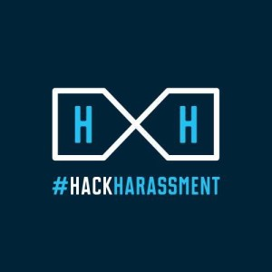

# Together we can #HackHarassment



Online harassment has become a pervasive and often vicious problem with real-life repercussions. Today’s tech and media leaders have a collective responsibility and capability to identify solutions that can help reduce different forms of online harassment.

Take the pledge : http://www.hackharassment.com/pledge/

Here are 3 practical ways that the Docker community can increase awareness of this problem.

## 1. Add a single slide

Over the coming months the Docker community will be involved in 1000's of presentations, demos, meetups, tech talks etc around the world.  If you are presenting, add one slide to the beginning or end of your talk to raise awareness of #HackHarassment.

## 2. Demo time

We all love an "Hello World" demo.  Mention #HackHarassment in the demo.  Perhaps a browser redirect to : http://www.hackharassment.com/ as part of the demo. Or a mention of the twitter handle in an API call? 

```
docker build -t hackharassment:now .
docker run -d -p 80 -name hh hackharassment:now
curl localhost:80
Online harassment more widespread than you think? Let’s change that. Help #HackHarassment

```

## 3. At source

If you are a project maintainer perhaps mention Hack Harassment as part of the projects Code of Conduct. Or mention that this project supports #HackHarassment and that it's contributors have taken the pledge.

